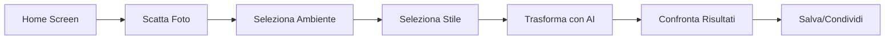

# MakeYourHomeAi 🏠✨

[](https://developer.android.com)
[](https://kotlinlang.org)
[](https://android-arsenal.com/api?level=24)
[](LICENSE)

Un'app Android intelligente che utilizza l'AI per trasformare virtualmente gli ambienti della tua casa, permettendoti di visualizzare come apparirebbero dopo una ristrutturazione con diversi stili di design.


---

## 🎯 Funzionalità

- 📸 **Cattura foto** di ambienti con fotocamera integrata
- 🏠 **6 tipi di ambienti**: Soggiorno, Cucina, Camera, Bagno, Giardino, Studio
- 🎨 **6 stili di design**: Moderno, Classico, Minimalista, Rustico, Industriale, Scandinavo
- 🤖 **Trasformazione AI** powered by Stability AI (Stable Diffusion XL)
- 📊 **Confronto prima/dopo** con visualizzazione side-by-side
- 💾 **Salvataggio risultati** per confronti futuri
- 🎭 **UI moderna** con Material Design 3 e Jetpack Compose

---

## 📱 Screenshot

| Home Screen | Camera | Transform | Result |
|------------|--------|-----------|--------|
|  |  |  |  |

---

## 🛠️ Tecnologie

### Stack Principale
- **Kotlin** - Linguaggio di programmazione
- **Jetpack Compose** - UI moderna e dichiarativa
- **CameraX** - Gestione fotocamera
- **Retrofit** - HTTP client per API calls
- **Stability AI** - Trasformazione immagini con AI
- **Coil** - Image loading e caching

### Architettura
- **MVVM** (Model-View-ViewModel)
- **Repository Pattern** per business logic
- **Coroutines** per operazioni asincrone
- **StateFlow** per reactive state management

---

## 📋 Requisiti

- **Android Studio**: Hedgehog (2023.1.1) o superiore
- **Android SDK**: API 24+ (Android 7.0+)
- **JDK**: 17 o superiore
- **Gradle**: 8.2
- **Stability AI API Key** (fornita nel progetto)

---

## 🚀 Quick Start

### 1. Clone il Repository

```bash
git clone https://github.com/RicAnn/MakeYourHomeAi.git
cd MakeYourHomeAi
```

### 2. Configura API Key

Il file `local.properties` è già configurato con l'API key:

```properties
STABILITY_API_KEY=your_api_key_here
```

✅ Nessuna configurazione aggiuntiva necessaria!

### 3. Apri in Android Studio

1. Apri Android Studio
2. File → Open → Seleziona la cartella `MakeYourHomeAi`
3. Attendi la sincronizzazione Gradle (automatica)

### 4. Esegui l'App

1. Connetti un dispositivo Android o avvia un emulatore
2. Clicca sul pulsante ▶️ Run (o premi `Shift+F10`)
3. L'app si installerà automaticamente

---

## 📖 Documentazione Completa

Per informazioni dettagliate, consulta:

- 📘 [**QUICK_START.md**](QUICK_START.md) - Guida rapida per iniziare
- 🔧 [**DEVELOPMENT.md**](DEVELOPMENT.md) - Guida allo sviluppo e architettura
- 🔌 [**API_INTEGRATION.md**](API_INTEGRATION.md) - Documentazione API Stability AI
- 📊 [**PROJECT_SUMMARY.md**](PROJECT_SUMMARY.md) - Riepilogo completo del progetto

---

## 🎨 Come Funziona

### Flusso Utente



### 1. Cattura Immagine
Usa la fotocamera integrata per scattare una foto dell'ambiente che vuoi trasformare.

### 2. Seleziona Parametri
Scegli:
- **Tipo di ambiente**: Soggiorno, Cucina, Camera, Bagno, Giardino, Studio
- **Stile di design**: Moderno, Classico, Minimalista, Rustico, Industriale, Scandinavo

### 3. Trasformazione AI
L'app invia l'immagine a Stability AI che applica il prompt personalizzato per generare una versione trasformata.

### 4. Risultato
Visualizza il confronto prima/dopo e salva il risultato!

---

## 🏗️ Struttura Progetto

```
MakeYourHomeAi/
│
├── app/src/main/
│   ├── java/com/makeyourhomeai/
│   │   │
│   │   ├── 📱 MainActivity.kt
│   │   │
│   │   ├── 🔧 data/
│   │   │   ├── api/
│   │   │   │   ├── StabilityAIService.kt     # API client
│   │   │   │   └── StabilityAIModels.kt      # Data models
│   │   │   ├── models/
│   │   │   │   ├── RoomType.kt               # Tipi ambienti
│   │   │   │   ├── DesignStyle.kt            # Stili design
│   │   │   │   └── TransformRequest.kt       # Request models
│   │   │   └── repository/
│   │   │       └── ImageTransformRepository.kt
│   │   │
│   │   └── 🎨 ui/
│   │       ├── screens/
│   │       │   ├── HomeScreen.kt             # Schermata iniziale
│   │       │   ├── CameraScreen.kt           # Cattura foto
│   │       │   └── TransformScreen.kt        # Trasformazione
│   │       ├── viewmodels/
│   │       │   └── TransformViewModel.kt     # State management
│   │       ├── navigation/
│   │       │   └── NavGraph.kt               # Navigation
│   │       └── theme/
│   │           ├── Theme.kt                  # Material Design
│   │           └── Type.kt                   # Typography
│   │
│   └── res/                                   # Android resources
│
├── 📚 Documentazione
│   ├── README.md                              # Questo file
│   ├── QUICK_START.md                         # Guida rapida
│   ├── DEVELOPMENT.md                         # Guida sviluppo
│   ├── API_INTEGRATION.md                     # Documentazione API
│   └── PROJECT_SUMMARY.md                     # Riepilogo progetto
│
└── ⚙️ Configurazione
    ├── build.gradle.kts
    ├── settings.gradle.kts
    └── local.properties                       # API key
```

---

## 🎯 Ambienti e Stili

### 🏠 Tipi di Ambienti (6)

| Icona | Nome | Descrizione |
|-------|------|-------------|
| 🛋️ | **Soggiorno** | Living room, salotto |
| 🍳 | **Cucina** | Kitchen, area pranzo |
| 🛏️ | **Camera da Letto** | Bedroom |
| 🚿 | **Bagno** | Bathroom |
| 🌳 | **Giardino** | Garden, outdoor |
| 💼 | **Studio** | Home office |

### 🎨 Stili di Design (6)

| Stile | Caratteristiche |
|-------|----------------|
| **Moderno** | Linee pulite, colori neutri, design minimalista |
| **Classico** | Mobili eleganti, design tradizionale, dettagli ornati |
| **Minimalista** | Essenziale, bianco, spazio pulito |
| **Rustico** | Legno naturale, toni caldi, elementi vintage |
| **Industriale** | Mattoni a vista, metallo, cemento, stile urbano |
| **Scandinavo** | Legno chiaro, pareti bianche, design funzionale |

---

## 💡 Esempi di Utilizzo

### Combinazioni Consigliate

| Ambiente | Stile Migliore | Risultato Atteso |
|----------|---------------|------------------|
| Soggiorno | Moderno | ⭐⭐⭐⭐⭐ Ambiente luminoso e contemporaneo |
| Cucina | Scandinavo | ⭐⭐⭐⭐⭐ Spazio funzionale e accogliente |
| Camera | Minimalista | ⭐⭐⭐⭐⭐ Ambiente rilassante e ordinato |
| Bagno | Moderno | ⭐⭐⭐⭐ Design pulito e elegante |
| Giardino | Rustico | ⭐⭐⭐⭐ Atmosfera naturale e calda |
| Studio | Industriale | ⭐⭐⭐⭐ Spazio produttivo e creativo |

---

## 📈 Performance

### Tempi di Elaborazione
- **Cattura foto**: Istantaneo
- **Trasformazione AI**: 30-60 secondi
- **Salvataggio risultato**: 2-3 secondi

### Ottimizzazioni Implementate
✅ Ridimensionamento automatico immagini (max 1024x1024)  
✅ Compressione ottimizzata  
✅ Cache intelligente  
✅ Operazioni asincrone con Coroutines  
✅ Timeout configurati appropriatamente  

---

## 🔐 Sicurezza e Privacy

- ✅ API key gestita in modo sicuro tramite `BuildConfig`
- ✅ File sensibili esclusi da Git (`.gitignore`)
- ✅ HTTPS per tutte le comunicazioni
- ✅ Permessi richiesti solo quando necessario
- ✅ Nessun dato utente inviato senza consenso

---

## 🐛 Troubleshooting

### Problemi Comuni

**❌ Gradle Sync Failed**
```bash
./gradlew clean
./gradlew build --refresh-dependencies
```

**❌ API Error 401**
- Verifica che `local.properties` contenga la chiave corretta
- Rebuild progetto: `Build > Clean + Rebuild`

**❌ Camera Permission Denied**
- Vai in Impostazioni → App → MakeYourHomeAi → Permessi
- Abilita "Fotocamera"

**❌ Timeout During Transform**
- Verifica connessione internet stabile
- Riprova (server API potrebbe essere occupato)

Per più dettagli, consulta [QUICK_START.md](QUICK_START.md#troubleshooting)

---

## 🚀 Roadmap

### v1.1 (Prossima Release)
- [ ] Implementa gallery picker
- [ ] Salvataggio in galleria Android
- [ ] Share functionality
- [ ] Loading indicators migliorati

### v1.2
- [ ] Storico trasformazioni locale
- [ ] Confronto slider interattivo
- [ ] Batch processing
- [ ] Export PDF report

### v1.3
- [ ] Cloud sync con Firebase
- [ ] Account utente
- [ ] Community sharing
- [ ] Rating e feedback

---

## 🤝 Contribuire

Contributi, issues e richieste di funzionalità sono benvenuti!

1. **Fork** il progetto
2. Crea un **branch** per la tua feature (`git checkout -b feature/AmazingFeature`)
3. **Commit** le modifiche (`git commit -m 'Add some AmazingFeature'`)
4. **Push** al branch (`git push origin feature/AmazingFeature`)
5. Apri una **Pull Request**

Consulta [DEVELOPMENT.md](DEVELOPMENT.md) per linee guida dettagliate.

---

## 📄 Licenza

Distribuito sotto licenza **MIT**. Vedi [LICENSE](LICENSE) per maggiori informazioni.

```
MIT License

Copyright (c) 2024 RicAnn

Permission is hereby granted, free of charge, to any person obtaining a copy
of this software and associated documentation files (the "Software"), to deal
in the Software without restriction...
```

---

## 👨‍💻 Autore

**RicAnn**

- GitHub: [@RicAnn](https://github.com/RicAnn)
- Repository: [MakeYourHomeAi](https://github.com/RicAnn/MakeYourHomeAi)

---

## 🎉 Ringraziamenti

- **Stability AI** per le potenti API di image generation
- **Android Team** per Jetpack Compose e CameraX
- **Open Source Community** per le librerie utilizzate:
  - Retrofit & OkHttp
  - Coil
  - Material Design 3
  - Kotlin Coroutines

---

## ⭐ Se ti piace questo progetto...

Lascia una ⭐ su GitHub! Ci aiuta a far crescere il progetto e a sviluppare nuove funzionalità.

---

<div align="center">

**🏠 MakeYourHomeAi - Trasforma la tua casa con l'intelligenza artificiale! ✨**

[Documentazione](QUICK_START.md) • [Issues](https://github.com/RicAnn/MakeYourHomeAi/issues) • [Contribuisci](DEVELOPMENT.md)

Made with ❤️ and 🤖 AI

</div>
